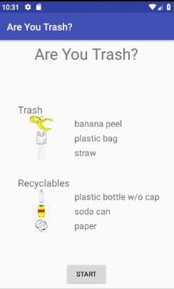

# TrashApp

An Andriod App that teaches people what items are recycable and how to recycle them. 

# Running the App
Clone the project with git clone 
Use an emulator or connect an Andriod phone to run application.

# Demo

  

